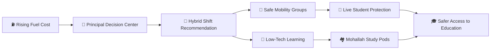
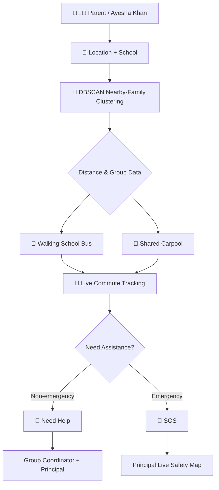
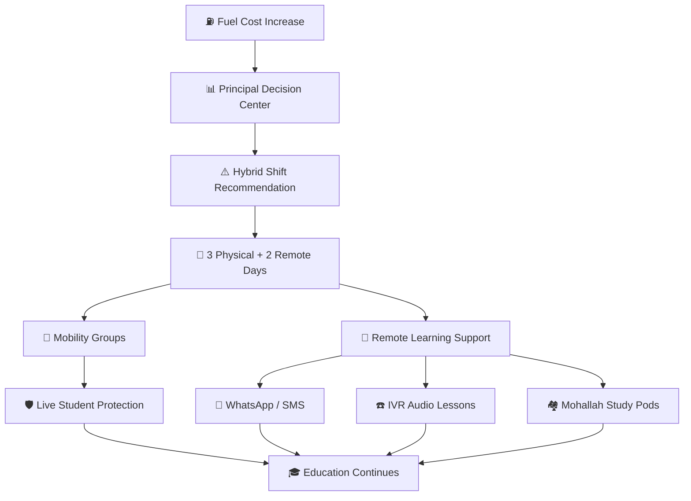
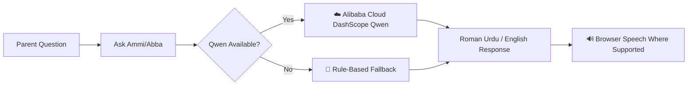
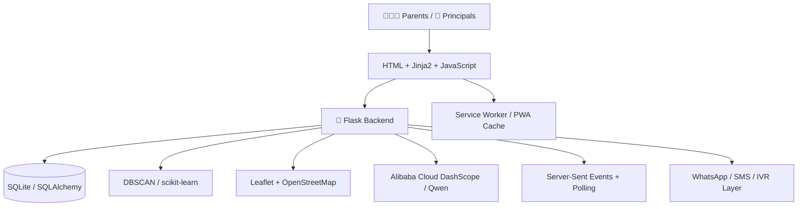

# 🚌 Safar-e-Taleem
## Safe Mobility • Student Protection • Learning Continuity

> **Because the journey should never become the cost of an education.**

**Built by Eeman e Fatima Awan & Mahnoor**  
**Alibaba Cloud Hackathon Prototype • Pakistan**

## 🌐 Live Demo

🚀 **Live application:** https://eemanefatimaawan.pythonanywhere.com/

**One-click hackathon access:**
- 👨‍👩‍👧 **Parent — Ayesha Khan:** https://eemanefatimaawan.pythonanywhere.com/demo-login/parent
- 🏫 **Principal — Dr. Zainab Qureshi:** https://eemanefatimaawan.pythonanywhere.com/demo-login/principal

No installation or password is required to explore the deployed prototype.

---

## ⚡ 60-Second Overview

**Safar-e-Taleem** (*Journey of Education*) is an AI-powered school mobility, student-safety and education-continuity platform designed for Pakistani families affected by rising transportation costs.

Instead of treating transport, safety and interrupted learning as separate problems, Safar-e-Taleem connects them into one workflow:

**Fuel pressure → smarter commute → live protection → hybrid decision → low-tech learning → community study support.**

The platform uses **DBSCAN** to connect nearby same-school families into walking/carpool groups, provides **live location and SOS protection**, helps principals respond to high fuel costs through a **Hybrid Shift Predictor**, supports **WhatsApp/SMS/IVR-style low-tech learning**, creates **Mohallah Study Pods**, and includes the **Ask Ammi/Abba** Roman-Urdu/English assistant with **Alibaba Cloud DashScope (Qwen)** integration.

---

# 🔄 How Safar-e-Taleem Works



The goal is not simply to help a child reach school. The system also helps education continue when reaching school becomes difficult.

---

## 🎯 The Problem

For many families, education access depends on whether they can afford and safely manage the daily journey to school. Rising transport costs can make regular attendance harder, while fully online learning is often unrealistic for households with limited internet access or shared devices.

Safar-e-Taleem focuses on three connected goals:

1. **Reduce the burden of daily school transport.**
2. **Make student journeys safer and more visible.**
3. **Keep learning accessible when physical attendance becomes difficult.**

---

# 👨‍👩‍👧 Parent Journey



### 🚌 Safe Walking & Carpool Groups
Parents provide their location and school information. **DBSCAN clustering** identifies nearby families attending the same school and organizes local commute groups. Depending on distance, the platform recommends a **Walking School Bus** or shared/carpool arrangement and displays potential savings.

### 🛡️ Need Help vs SOS
Safar-e-Taleem deliberately separates routine support from emergencies:

- **Need Help** — a non-emergency commute-support request can reach the group coordinator and principal.
- **SOS** — an immediate safety alert during live location sharing is surfaced through the principal's safety workflow.

### 📍 Live Student Protection
Parents can share their live location during a journey. The principal dashboard provides a live safety view with journey status and alerts. The prototype uses **Server-Sent Events (SSE)** with polling fallback for resilient updates.

---

# 🏫 Principal Education-Continuity Flow



### ⛽ Hybrid Shift Predictor
The principal dashboard monitors fuel-cost conditions and helps schools explore a hybrid attendance response when commuting becomes unusually expensive.

In the prototype, a **3-day physical / 2-day remote** schedule reduces physical commute frequency by approximately **40% compared with five physical school days**. This is a prototype scenario estimate, not a measured real-world outcome.

### 🧭 Education Continuity Workflow
The principal can generate a coordinated response connecting:

**Fuel pressure → hybrid scheduling → mobility → remote learning → study pods → live protection.**

This turns the dashboard from a fuel-warning screen into a decision-support system for keeping students connected to school.

---

# 🤖 AI + Decision Support



### 🎙️ Ask Ammi/Abba
**Ask Ammi/Abba** provides natural Roman-Urdu and English assistance for parents. The project supports **Alibaba Cloud DashScope (Qwen)** when configured and includes a rule-based fallback when the external AI service is unavailable.

Browser speech synthesis/recognition is used where supported by the user's browser and device.

### 🧠 Smart Parent Recommendation
The parent dashboard converts existing cluster, distance and savings information into a clear family-specific commute recommendation. These recommendations use deterministic decision-support logic rather than additional LLM calls.

### 📊 Principal Decision Center
The principal receives quick visibility into commute pressure, mobility opportunities, device-access support and active safety alerts.

---

# 📱 Learning When the Journey Is Difficult

### Low-Tech Learning Delivery
Safar-e-Taleem is designed for families who may not have laptops or reliable broadband. Lightweight learning can be delivered through channels such as:

- 💬 WhatsApp micro-lessons
- 📩 SMS learning tasks
- ☎️ IVR/audio explainers
- 📦 Offline learning packets

Provider integrations can operate in simulation mode during demonstrations when external credentials are not configured.

### 🏘️ Mohallah Study Pods
When some students have access to a smartphone/device and others do not, Safar-e-Taleem connects nearby families into **Mohallah Study Pods**, allowing students to share device access and offline learning resources within their community.

---

# ✨ Core Features

| Feature | What it does |
|---|---|
| **AI Walking Groups** | DBSCAN clusters nearby same-school families into safe commute groups. |
| **Smart Parent Recommendation** | Recommends walking/shared/carpool options using distance, cluster and savings data. |
| **Live Petrol Monitor** | Surfaces Pakistani fuel-price information for school decision-making. |
| **Hybrid Shift Predictor** | Helps principals explore a 3-physical / 2-remote-day response to high commuting costs. |
| **Live Student Protection** | Live location sharing, journey status, principal safety map and SOS alerts. |
| **Need Help Workflow** | Separates non-emergency family support from emergency SOS handling. |
| **Ask Ammi/Abba AI** | Roman-Urdu/English assistant with optional Alibaba Cloud Qwen integration and fallback mode. |
| **Mohallah Study Pods** | Connects nearby students to improve shared-device and learning-resource access. |
| **WhatsApp / SMS / IVR** | Supports low-data learning delivery, with simulation mode for demos. |
| **Offline-first PWA** | Installable web app with caching support for unreliable connectivity. |
| **Education Continuity Workflow** | Connects fuel pressure, scheduling, mobility, remote learning, study pods and safety. |
| **Principal Decision Center** | Converts operational signals into clear school actions. |

---

# 📸 Prototype Screenshots

### Landing Page


### Parent Dashboard


### Principal Dashboard


### Live Safety Map


### Registration & Address Lookup


---

# 🏗️ Technical Architecture



## 🛠 Technology Stack

- **Backend:** Python, Flask, Flask-SQLAlchemy, SQLite
- **AI:** Alibaba Cloud DashScope (Qwen) via OpenAI-compatible SDK
- **Machine Learning:** scikit-learn DBSCAN, NumPy, pandas
- **Maps:** Leaflet + OpenStreetMap
- **Real-time:** Server-Sent Events (SSE) + polling fallback
- **Frontend:** HTML/Jinja2, vanilla JavaScript, CSS, Chart.js, Web Speech API
- **Low-tech delivery:** WhatsApp/SMS provider integrations + simulation mode
- **Offline support:** Progressive Web App + service worker
- **Deployment:** PythonAnywhere

---

# 🧠 Why AI/ML Is Used

Safar-e-Taleem uses AI/ML where it solves a specific problem:

- **DBSCAN** performs geographic clustering without requiring a predefined number of groups.
- **Alibaba Cloud Qwen** supports accessible Roman-Urdu/English assistance when the external service is available.
- **Fuel-aware decision logic** supports the principal's hybrid-shift planning workflow.
- **Location/routing services** connect commute recommendations with real map-based journeys.

---

# 📊 Potential Impact

The prototype demonstrates how schools and communities could:

- reduce unnecessary individual school trips through shared mobility;
- improve visibility and safety during student journeys;
- maintain learning access when physical attendance becomes difficult;
- support students with limited device or connectivity access;
- make school information more accessible through Roman-Urdu interaction.

> **Prototype metric:** A 3-physical-day week represents approximately **40% fewer physical commute days** than a five-physical-day week. This is a scenario estimate, not a validated real-world cost-reduction study.

---

# 🚀 Run Locally

```bash
pip install -r requirements.txt
cp .env.example .env
python app.py
```

The application creates its local database and demo data on first run.

### Demo Access

- **Parent:** `/demo-login/parent`
- **Principal:** `/demo-login/principal`

For Qwen integration, add your own `DASHSCOPE_API_KEY` to `.env`. **Never commit real credentials to GitHub.**

---

# 🧪 Tests

```bash
python -m pytest tests/ -q
```

The test suite covers core commute, geographic, notification, AI, petrol, curriculum and API behavior. External notifications can run in simulation mode so the prototype can be demonstrated without exposing provider credentials.

---

# ☁️ Deployment

The public hackathon prototype is deployed on **PythonAnywhere**:

**https://eemanefatimaawan.pythonanywhere.com/**

Judges can use the Parent and Principal demo routes without installing the project locally. The repository also contains Docker/gunicorn-compatible configuration for other deployment environments.

---

# 🔐 Environment & Security

Real API keys, passwords and tokens must **never** be committed to the repository. Use `.env` locally and keep only placeholder values in `.env.example`.

| Variable | Purpose |
|---|---|
| `SECRET_KEY` | Flask session signing |
| `DASHSCOPE_API_KEY` | Alibaba Cloud Qwen integration |
| `WHATSAPP_TOKEN` / `WHATSAPP_PHONE_NUMBER_ID` | Optional WhatsApp delivery integration |
| `SMS_GATEWAY_URL` / related credentials | Optional SMS gateway integration |
| `DATABASE_URL` | Production database configuration |
| `SSE_CYCLE_SECONDS` | Live-location stream cycle configuration |
| `FLASK_DEBUG` | Development/production debug configuration |
| `PORT` | Application port supplied by the hosting environment |

See `.env.example` for the configuration template.

---

# 🏆 Hackathon Vision

Safar-e-Taleem is not simply a transport application. It treats **mobility, student safety and continuity of education as one connected problem**.

When a child can reach school, the platform helps make that journey safer and more affordable. When the journey itself becomes the barrier, Safar-e-Taleem helps the school and community adapt so learning can continue.

### **Safar-e-Taleem doesn't just help a child reach school — it helps education continue when reaching school becomes difficult.**

> ## **Because the journey should never become the cost of an education.**
