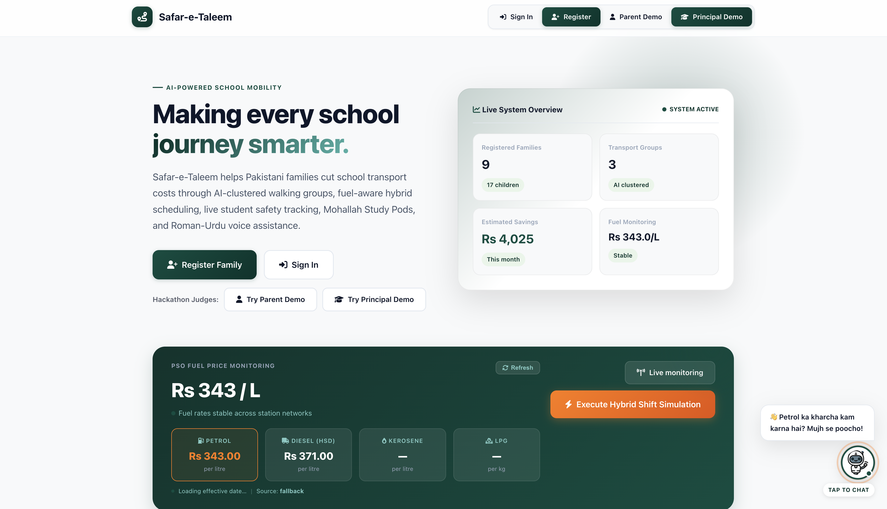
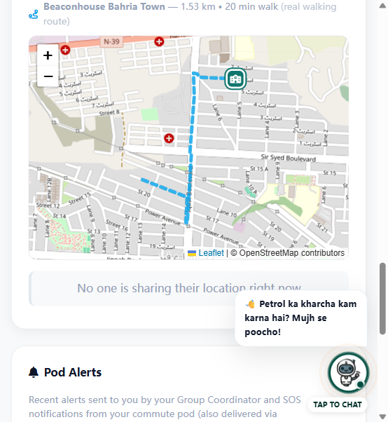
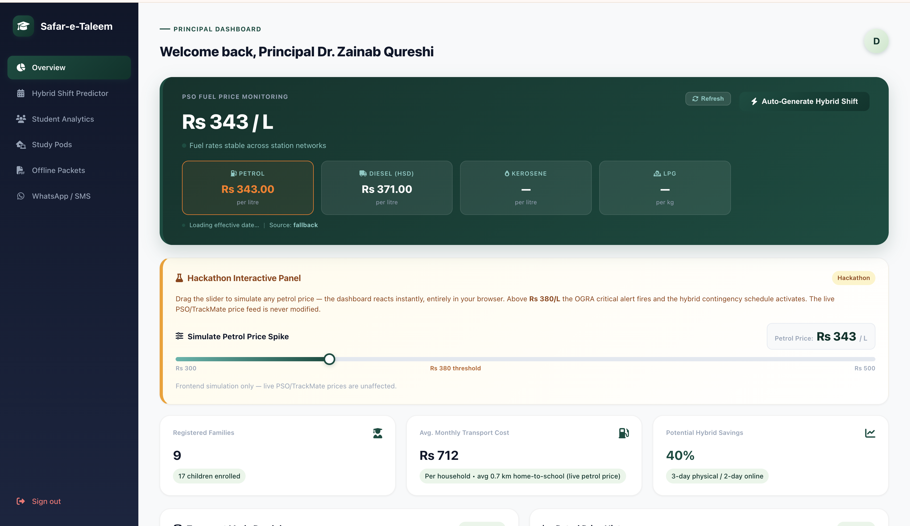
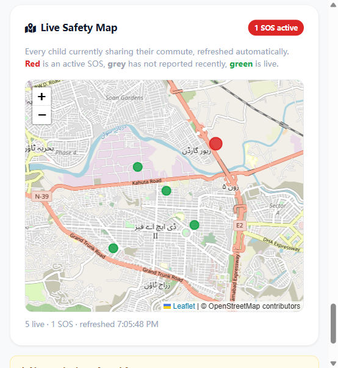
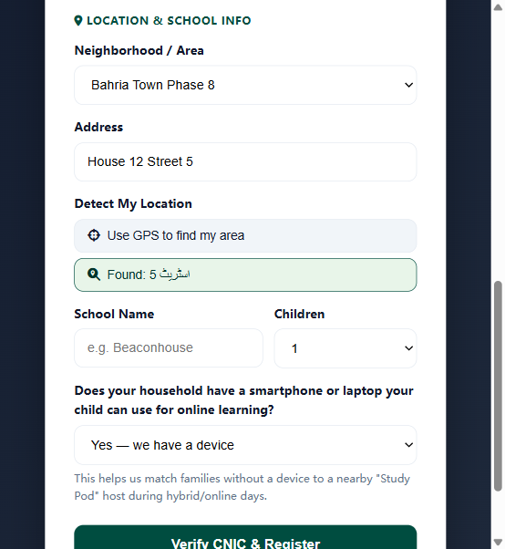

# 🚌 Safar-e-Taleem — Safe Mobility & Learning Continuity for Pakistan

> **Because the journey should never become the cost of an education.**

## 🌐 Live Demo

🚀 **Try Safar-e-Taleem:** https://eemanefatimaawan.pythonanywhere.com/

**Hackathon demo access:**
- 👨‍👩‍👧 **Parent Demo:** https://eemanefatimaawan.pythonanywhere.com/demo-login/parent
- 🏫 **Principal Demo:** https://eemanefatimaawan.pythonanywhere.com/demo-login/principal

No installation or local setup is required to explore the deployed prototype.

Safar-e-Taleem (*Journey of Education*) is an AI-powered school mobility, student-safety, and learning-continuity platform designed for Pakistani families affected by rising transportation costs.

Built for the **Alibaba Cloud Hackathon**, the prototype brings together safe commute coordination, live student protection, fuel-aware school planning, low-tech learning delivery, community device sharing, and a Roman-Urdu/English AI assistant designed to integrate with **Alibaba Cloud DashScope (Qwen)**.

---

## 🎯 The Problem

For many families, access to education also depends on whether they can afford and safely manage the daily journey to school. Rising transport costs can make regular attendance harder, while fully online learning is not always practical for households with limited internet access or shared devices.

Safar-e-Taleem addresses the problem through three goals:

1. **Reduce the burden of daily school transport.**
2. **Make student journeys safer and more visible.**
3. **Keep learning accessible when reaching school becomes difficult.**

---

## 💡 The Solution

Safar-e-Taleem connects **parents and school principals** through one practical platform designed around real-world constraints in Pakistan.

### 🚌 1. Safe Walking & Carpool Groups

Parents provide their location and school information. Safar-e-Taleem uses **DBSCAN clustering** to identify nearby families attending the same school and organize local commute groups.

Depending on distance, families can coordinate a **Walking School Bus** or shared transport/carpool arrangement. The platform also calculates travel information and potential transport savings.

### 🛡️ 2. Live Student Protection

Parents can share their live location during the school journey. The principal dashboard provides a live safety view, while one-tap **SOS alerts** can surface an emergency with location information to relevant group members and the school.

The live system uses **Server-Sent Events (SSE)** with polling fallback for resilient location updates.

### ⛽ 3. Hybrid Shift Predictor

The principal dashboard monitors fuel-cost conditions and helps schools explore a hybrid attendance response when commuting becomes unusually expensive.

In the prototype, a **3-day physical / 2-day remote** schedule reduces physical commute frequency by approximately **40% compared with five physical school days**. This is a prototype scenario estimate, not a measured real-world outcome.

### 📱 4. Low-Tech Learning Delivery

Safar-e-Taleem is designed for families who may not have laptops or reliable broadband. Lightweight learning material can be delivered through channels such as **WhatsApp, SMS and IVR**.

Provider integrations can operate in simulation mode during demonstrations when external credentials are not configured.

### 🏘️ 5. Mohallah Study Pods

When some students have access to a smartphone or device and others do not, Safar-e-Taleem helps connect nearby families into **Mohallah Study Pods**. This allows students to share access to devices and offline learning resources within their local community.

### 🎙️ 6. Ask Ammi/Abba — Roman-Urdu AI Assistant

To make the platform easier for parents to use, Safar-e-Taleem includes **Ask Ammi/Abba**, a voice-enabled assistant for natural Roman Urdu and English interaction.

The project supports **Alibaba Cloud DashScope (Qwen)** when the required API configuration is available and includes a rule-based fallback when the external AI service is unavailable. The availability of the external Qwen service can depend on the deployment environment.

---

## ✨ Core Features

| Feature | What it does |
|---|---|
| **AI Walking Groups** | DBSCAN clustering groups nearby families attending the same school into safe commute groups. |
| **Fuel-aware routing** | Recommends walking/shared/carpool options based on distance and fuel conditions and estimates savings. |
| **Live Petrol Monitor** | Tracks Pakistani fuel-price information and visualizes conditions for the principal dashboard. |
| **Hybrid Shift Predictor** | Helps principals explore a 3-day physical / 2-day remote response to high commuting costs. |
| **Live Student Protection** | Live location sharing, principal safety map, journey status and SOS alerts. |
| **Ask Ammi/Abba AI** | Roman-Urdu/English chat and voice interface with optional Alibaba Cloud Qwen integration and fallback mode. |
| **Mohallah Study Pods** | Connects nearby students to improve access to shared devices and learning resources. |
| **WhatsApp / SMS / IVR Delivery** | Supports low-data curriculum and alert delivery, with simulation mode for demos. |
| **Offline-first PWA** | Installable web app with caching support for unreliable connectivity. |

---

## 📸 Prototype Screenshots

### Landing Page
Live fuel information and Safar-e-Taleem's main tools at a glance.



### Parent Dashboard
Walking/carpool coordination with an OpenStreetMap-based route and commute information.



### Principal Dashboard
Fuel monitoring and hybrid scheduling tools for school decision-makers.



### Live Safety Map
Principal view for monitoring active student journeys and safety status.



### Registration & Address Lookup
Families can enter a typed address that is resolved to coordinates when GPS is unavailable or not preferred.



---

## 🛠 Technology Stack

- **Backend:** Python, Flask, Flask-SQLAlchemy, SQLite
- **AI:** Alibaba Cloud DashScope (Qwen) integration via the OpenAI-compatible SDK
- **Machine Learning:** scikit-learn DBSCAN, NumPy, pandas
- **Maps:** Leaflet + OpenStreetMap
- **Real-time updates:** Server-Sent Events (SSE) + polling fallback
- **Frontend:** HTML/Jinja2, vanilla JavaScript, CSS, Chart.js, Web Speech API
- **Low-tech delivery:** WhatsApp/SMS provider integrations + simulation mode
- **Offline support:** Progressive Web App (PWA) + service worker
- **Live deployment:** PythonAnywhere

---

## 🧠 How the AI/ML Fits In

Safar-e-Taleem uses technology where it solves a specific problem rather than adding AI only as a label:

- **DBSCAN** performs geographic clustering of nearby same-school families without requiring a predefined number of groups.
- **Alibaba Cloud Qwen integration** supports accessible Roman-Urdu/English assistance for parents when the external service is available.
- **Fuel-aware decision logic** supports the principal's hybrid-shift planning workflow.
- **Location and routing services** connect commute recommendations with real map-based journeys.

---

## 📊 Potential Impact

The prototype is designed to demonstrate how schools and communities could:

- reduce unnecessary individual school trips through shared mobility;
- improve visibility and safety during student journeys;
- maintain learning access when physical attendance becomes difficult;
- support students with limited device or connectivity access;
- make school information more accessible to parents through Roman-Urdu voice interaction.

The **~40% commute reduction** shown by the hybrid-shift feature refers specifically to the prototype 3-physical-day versus 5-physical-day weekly scenario. It should not be interpreted as a validated real-world cost reduction study.

---

## 🚀 Run Locally

```bash
pip install -r requirements.txt
cp .env.example .env
python app.py
```

The application creates its local database and demo data on first run.

### Demo Access

No password is needed for the dedicated hackathon demo routes:

- **Parent:** `/demo-login/parent`
- **Principal:** `/demo-login/principal`

For Qwen integration, add your own `DASHSCOPE_API_KEY` to the local `.env` file. **Never commit real credentials to GitHub.**

---

## 🧪 Tests

```bash
python -m pytest tests/ -q
```

The test suite covers core commute, geographic, notification, AI, petrol, curriculum and API behavior. External notifications can run in simulation mode so the prototype can be demonstrated without exposing provider credentials.

---

## ☁️ Deployment

### Live Hackathon Deployment — PythonAnywhere

The current public prototype is deployed at:

**https://eemanefatimaawan.pythonanywhere.com/**

Judges can use the Parent and Principal demo buttons on the landing page without installing the project locally.

The repository also contains a `Dockerfile` and gunicorn-compatible configuration for other deployment environments.

---

## 🔐 Environment & Security

Real API keys, passwords and tokens must **never** be committed to the repository. Use `.env` locally and keep only placeholder values in `.env.example`.

Important configuration includes:

| Variable | Purpose |
|---|---|
| `SECRET_KEY` | Flask session signing |
| `DASHSCOPE_API_KEY` | Alibaba Cloud Qwen integration |
| `WHATSAPP_TOKEN` / `WHATSAPP_PHONE_NUMBER_ID` | Optional WhatsApp delivery integration |
| `SMS_GATEWAY_URL` / related credentials | Optional SMS gateway integration |
| `DATABASE_URL` | Production database configuration |
| `SSE_CYCLE_SECONDS` | Live-location stream cycle configuration |
| `FLASK_DEBUG` | Development/production debug configuration |
| `PORT` | Application port supplied by the hosting environment |

See `.env.example` for the configuration template.

---

## 🏆 Hackathon Vision

Safar-e-Taleem is not simply a transport application. It treats **mobility, student safety and continuity of education as one connected problem**.

When a child can reach school, the platform helps make that journey safer and more affordable. When the journey itself becomes the barrier, Safar-e-Taleem helps the school and community adapt so learning can continue.

> ### **Because the journey should never become the cost of an education.**
